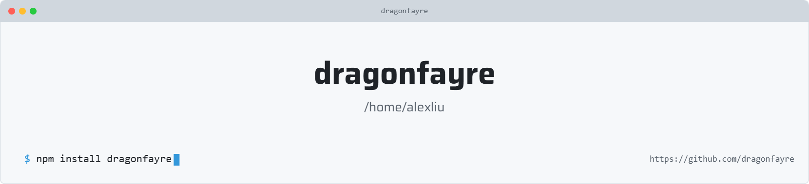

<picture>
   <source media="(prefers-color-scheme: dark)" srcset="art/header-dark.png">
   
</picture>

<!--
  ============================================================
  🌸  COLOR PALETTE (.env style reference) — dragonfayre theme
  ============================================================
  PRIMARY   = #FF69B4   (Hot Pink)
  SECONDARY = #EF93C4   (Rose Pink)
  ACCENT    = #F8BBD0   (Blush Pink)
  LIGHT     = #FFF0F5   (Lavender Blush)
  DARK      = #1B1023   (Deep Plum Black)
  ============================================================
-->

<!-- Responsive Banner (Light/Dark) -->
<picture>
  <source media="(prefers-color-scheme: dark)" srcset="https://capsule-render.vercel.app/api?type=waving&color=1B1023&height=250&section=header&text=&fontColor=FF69B4">
  <source media="(prefers-color-scheme: light)" srcset="https://capsule-render.vercel.app/api?type=waving&color=FF69B4&height=250&section=header&text=&fontColor=FFF0F5">
  
</picture>

<!-- Title -->
<h1 align="center">✨ Hey there, I'm dragonfayre 👋</h1>

<!-- Typing SVG -->

 

<!-- Badges -->

  
  
  

 

<!-- ============================================================
     ABOUT ME
============================================================ -->
<h2 align="center">🌷 About Me</h2>

<table align="center" width="100%">
  <tr>
    <td width="65%" valign="middle">
      

        🌸 &nbsp;<b>Who I am:</b> A passionate developer who loves turning ideas into elegant, functional code.  
        💻 &nbsp;<b>What I do:</b> Building clean, modern web experiences with a love for detail and design.  
        🌱 &nbsp;<b>Currently

<!--
**dragonfayre/dragonfayre** is a ✨ _special_ ✨ repository because its `README.md` (this file) appears on your GitHub profile.

Here are some ideas to get you started:

- 🔭 I’m currently working on ...
- 🌱 I’m currently learning ...
- 👯 I’m looking to collaborate on ...
- 🤔 I’m looking for help with ...
- 💬 Ask me about ...
- 📫 How to reach me: ...
- 😄 Pronouns: ...
- ⚡ Fun fact: ...
-->
